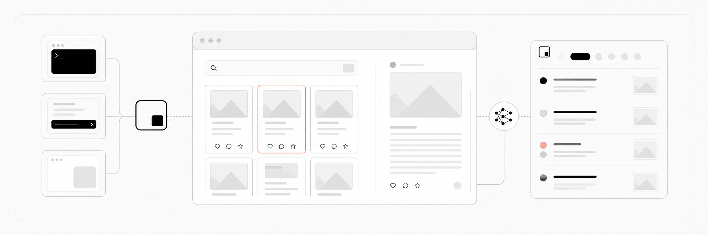

<div align="center">

<a href="https://socai.io/?utm_source=github&amp;utm_medium=readme&amp;utm_campaign=main-repo-logo">
  
</a>

# socai

**English** · [简体中文](README.zh-CN.md) · [日本語](README.ja.md) · [한국어](README.ko.md)

**A local web agent optimized for Xiaohongshu (RedNote) research**

Connect your signed-in Chrome session and let an agent read posts, comments, and media for content research, competitive analysis, and consumer insight work.

[Website](https://socai.io/?utm_source=github&utm_medium=readme) · [Download](#desktop-app) · [Quick start](#quick-start) · [Command reference](#xiaohongshu-command-reference) · [Development](DEVELOPMENT.md)

[](https://github.com/socai-io/socai/releases/latest)
[](#desktop-app)
[](LICENSE)

<br>

<a href="https://socai.io/?utm_source=github&amp;utm_medium=readme&amp;utm_campaign=main-repo-banner">
  
</a>

</div>

## Overview

socai is built for research tasks that require understanding Xiaohongshu content. It connects to a real browser through the Chrome DevTools Protocol (CDP), reuses an existing login session, and performs searches, opens posts, expands comments, and visits author profiles through page interactions. Results are saved as structured data and local artifacts.

Typical tasks include:

- tracking emerging topics, emotions, and language within a category
- reading posts and comment threads to identify needs, concerns, and decision language
- comparing how brands, products, stores, or campaigns are discussed
- studying an account's content direction, popular posts, and audience response
- downloading images and videos, then adding OCR and video-transcript evidence

The current product focuses on reading and research. It does not provide publishing, liking, saving, or commenting actions.

https://github.com/user-attachments/assets/8aebcded-f365-4f12-b9c4-102cc1fa964d

## Highlights

| Capability | What it provides |
| --- | --- |
| Real-browser execution | Connects to your Chrome session and follows page interaction paths without depending on reverse-engineered APIs or high-volume batch requests. |
| Post and comment reading | Collects titles, bodies, authors, engagement data, comments, and replies. |
| Multimodal understanding | Downloads post images and videos, runs local image OCR, and supports video speech transcription. |
| Research filters and sampling | Uses Xiaohongshu page filters for publish time, post type, sorting, search scope, and distance. |
| Evidence and artifact retention | Keeps structured results, media manifests, and task deliverables for review and continued analysis. |
| Three user interfaces | Shares one Rust core across the desktop app, command-line interface, and terminal interface. |
| Agent-friendly output | Returns structured JSON that Claude Code, Codex, and other agents can call directly. |

## Quick start

### Desktop app

Use the desktop app to enter research tasks without setting up a command-line environment. It is available for macOS and Windows:

- [Download for macOS](https://github.com/socai-io/socai/releases/latest/download/socai-macos-universal.dmg)
- [Download for Windows](https://github.com/socai-io/socai/releases/latest/download/socai-windows-x86_64-setup.exe)

After installation, follow the in-app steps to connect Chrome and enter a task such as:

> Research high-engagement Xiaohongshu posts about sugar-free tea from the past month. Focus on what users care about when choosing a brand, and cite specific posts and comments.

The first connection to your existing Chrome requires enabling remote debugging and confirming the browser permission prompt. See the [Connect Chrome guide](https://socai.io/connect).

The desktop app keeps task history and artifacts. You can preview or download reports, spreadsheets, images, and other deliverables, or export results to a Feishu document or group chat.

### Command line

The CLI is designed for Claude Code, Codex, and other agents, as well as users who need structured data or scripted workflows.

macOS:

```bash
curl -fsSL https://github.com/socai-io/socai/releases/latest/download/install.sh | sh
```

Windows PowerShell:

```powershell
$installer = Join-Path $env:TEMP 'socai-install.ps1'; Invoke-WebRequest -UseBasicParsing https://github.com/socai-io/socai/releases/latest/download/install.ps1 -OutFile $installer; Unblock-File $installer; & $installer
```

The installers download and verify the release archive, install socai at `~/.socai/bin/socai` on macOS or `%USERPROFILE%\.socai\bin\socai.exe` on Windows, and configure or explain the PATH update.

Run your first Xiaohongshu search:

```bash
socai xhs search "beginner camping gear mistakes" --num-notes 10 --num-comments 8 --pretty
```

If a prebuilt binary is unavailable for your platform, or you need a source build for development, use Cargo:

```bash
git clone https://github.com/socai-io/socai.git
cd socai
cargo install --path cli --force
cargo install --path asr --force
```

The second command installs the local Whisper helper next to `socai`; it is
required when unpaid or offline transcription routes to the bundled model.

### Terminal interface

After installing the CLI, run `socai` without a subcommand to open the terminal interface:

```bash
socai
```

## Choose an interface

| Interface | Best for | Start with |
| --- | --- | --- |
| Desktop app | Natural-language tasks, task history, and artifact preview or download | Install the macOS or Windows app |
| CLI | Agent calls, scripts, and structured JSON | Run `socai xhs ...` |
| Terminal interface | Manually running consecutive tasks in a terminal | Run `socai` |

All three interfaces share the same browser connection, site capabilities, and run-record core.

## Xiaohongshu command reference

### Search and read posts

```bash
socai xhs search "content marketing ideas" \
  --num-notes 30 \
  --num-comments 20 \
  --filter publish_time=一周内 \
  --filter sort=最多评论 \
  --download-media \
  --ocr \
  --pretty
```

`search` opens result posts and reads their bodies and comments. Add `--preview` to return only result-card metadata such as titles, covers, and engagement counts without opening post details.

### Read an author and their posts

```bash
socai xhs author <author_id> --num-notes 10 --num-comments 8
```

Return only the author and post-card summaries:

```bash
socai xhs author <author_id> --num-notes 20 --preview
```

### Read selected posts again

Use the post IDs and `xsec_token` values returned by `search` or `author`:

```bash
socai xhs get-notes \
  --note '<note_id>=<xsec_token>' \
  --note '<note_id>=<xsec_token>' \
  --num-comments 20
```

### Common options

| Option | Purpose |
| --- | --- |
| `--num-notes <N>` | Target number of posts; socai scrolls when more results are needed. |
| `--num-comments <N>` | Number of comments and replies per post; use `0` to skip comments. |
| `--preview` | Read only search-result or author-page post cards. |
| `--download-media` | Download images and videos from opened posts and record local paths. |
| `--ocr` | Run local OCR on post images or a video post's cover. |
| `--transcribe-audio` | Download opened videos and transcribe speech; requires signing in and selecting socai agent. |
| `--filter <group=option>` | Apply a Xiaohongshu search-page filter; repeat to combine filters. |
| `--pretty` | Pretty-print the final JSON result. |
| `--debug-snapshot` | Save page DOM, accessibility trees, and screenshots for development diagnostics. |

Available filter groups and UI values:

| Group | Values |
| --- | --- |
| `sort` | 综合, 最新, 最多点赞, 最多评论, 最多收藏 |
| `note_type` | 不限, 视频, 图文 |
| `publish_time` | 不限, 一天内, 一周内, 半年内 |
| `search_scope` | 不限, 已看过, 未看过, 已关注 |
| `distance` | 不限, 同城, 附近 |

Filter values mirror the Xiaohongshu web interface and should be passed as shown. Multiple filters can be combined:

```bash
socai xhs search "Shanghai weekend activities" \
  --filter publish_time=一周内 \
  --filter note_type=图文 \
  --filter sort=最新
```

## Browser and login modes

socai supports four Chrome profile modes:

| Mode | Best for | Login behavior |
| --- | --- | --- |
| `existing` | Everyday use; the default | Reuses your existing Chrome and Xiaohongshu login |
| `managed` | Isolating research from everyday browsing | Uses `~/.socai/chrome-profile`; sign in once |
| `auto` | Automatic connection selection | Tries the managed profile first, then falls back to existing Chrome |
| `remote` | Testing a hosted cloud browser | Beta socai pro capability with session limits |

These settings are stored in `~/.socai/config.json`; the CLI and desktop app read the same configuration.

Switch to an isolated profile:

```bash
socai config set chrome.profile managed
socai stop
```

Set a custom managed profile directory:

```bash
socai config set chrome.profile_dir ~/.socai/profiles/xhs-research
```

Switch back to your existing Chrome:

```bash
socai config set chrome.profile existing
socai stop
```

`socai stop` is only required when the background daemon is already running; it lets the new setting take effect at the next start.

The hosted browser is currently in beta. Activate socai pro before selecting it:

```bash
socai pro activate <invite_code>
socai config set chrome.profile remote
```

Advanced endpoint overrides remain available through `SOCAI_CDP_WS` and `SOCAI_CDP_URL`.

## Run results and artifacts

Each run is written under the following directory by default:

```text
~/.socai/runs/<timestamp>_<task>/
```

Typical contents include:

- final structured results and run metadata
- search, post, and author data
- downloaded images, videos, and OCR output
- a `media_manifest.json` media inventory
- debug snapshots and agent-generated reports, spreadsheets, or other deliverables

Change the run directory on macOS:

```bash
socai config set runs.dir "$(pwd)/socai-runs"
```

Or in Windows PowerShell:

```powershell
socai config set runs.dir (Join-Path $PWD 'socai-runs')
```

Relative values passed to `runs.dir` are stored as absolute paths from the current directory. `SOCAI_RUNS_DIR` takes precedence when set.

## Douyin search

The CLI also provides basic Douyin search:

```bash
socai dy search "coffee" --num 30
```

Xiaohongshu research remains the primary product focus. Run `socai dy --help` for the current Douyin command surface.

## Extending and developing socai

To add another site or custom capability, follow the [site extension guide](core/src/sites/creation/SKILL.md). It covers requirement confirmation, site capability design, and implementation steps for coding agents such as Claude Code, Codex, and Cursor.

Local development, build instructions, repository conventions, and the reference-document index live in [DEVELOPMENT.md](DEVELOPMENT.md).

## Community


Feedback about product usage, research workflows, and feature ideas is welcome. If socai is useful to you, consider starring the repository to support its continued development.

## License

socai is licensed under the [Apache License 2.0](LICENSE).
